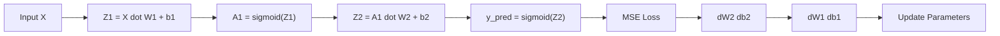

# NumPy Neural Network Tutorial (Split by Program)

You asked for the tutorial to be separated, not all in one file.
This folder now uses small step-by-step programs, and each file explains which NumPy functions are used and why.

## Tutorial Files (Run in Order)

1. `Numpy/tutorials/01_array_shape_basics.py`
2. `Numpy/tutorials/02_linear_layer_and_broadcasting.py`
3. `Numpy/tutorials/03_activation_and_loss.py`
4. `Numpy/tutorials/04_backprop_one_layer.py`
5. `Numpy/tutorials/05_two_layer_xor_training.py`

Run one file:

```bash
python3 Numpy/tutorials/01_array_shape_basics.py
```

## What Each Program Teaches

### 1) `01_array_shape_basics.py`
Goal: tensor format and shape handling.

Functions and usage:
- `np.array`: create `X`, `y`, vectors
- `.shape`: check dimensions
- `.reshape`: convert vector format
- `.T`: transpose matrix
- `np.expand_dims`: add batch axis
- `np.squeeze`: remove singleton axis

### 2) `02_linear_layer_and_broadcasting.py`
Goal: linear layer math (`Z = X @ W + b`).

Functions and usage:
- `np.random.seed`: same random values every run
- `np.random.randn`: random weight initialization
- `np.zeros`: bias initialization
- `@`: matrix multiplication
- broadcasting with `+ b`: add bias to each sample
- `np.sum(..., axis=0, keepdims=True)`: preserve bias shape

### 3) `03_activation_and_loss.py`
Goal: activation and loss building blocks.

Functions and usage:
- `np.exp`: sigmoid
- `np.maximum`: ReLU
- `np.tanh`: tanh
- `np.mean`: MSE loss
- `np.clip` + `np.log`: stable BCE loss

### 4) `04_backprop_one_layer.py`
Goal: manual gradient flow for one layer.

Functions and usage:
- `@`: forward and gradient matrix multiplies
- `np.mean`: loss
- elementwise `*`: chain rule combination
- `.T`: `dW = X.T @ dZ`
- `np.sum(axis=0, keepdims=True)`: `db`

### 5) `05_two_layer_xor_training.py`
Goal: full training loop (forward, backward, update).

Functions and usage:
- `np.random.randn`, `np.zeros`: parameters
- `np.exp`: sigmoid
- `@`, `.T`, broadcasting: all layer math
- `np.mean`: MSE
- `np.sum(axis=0, keepdims=True)`: bias gradients
- `(y_pred > 0.5).astype(int)`: binary prediction

## Neural Network Flow (Mermaid)



## Shape Format Reference

- `X`: `(N, D_in)`
- `W1`: `(D_in, H)`
- `b1`: `(1, H)`
- `A1`: `(N, H)`
- `W2`: `(H, D_out)`
- `b2`: `(1, D_out)`
- `y_pred`: `(N, D_out)`

## Exercises

Use:
- `Numpy/lecture_exercises.py`

Run:

```bash
python3 Numpy/lecture_exercises.py
```

It checks if students learned from lecture topics:
- chain rule
- forward shape logic
- one-step gradient update
- vanishing gradients
- XOR training behavior
