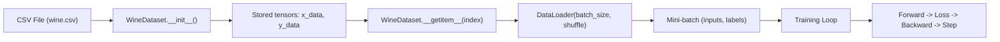
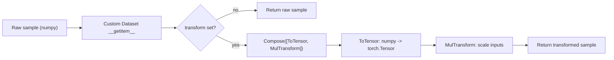
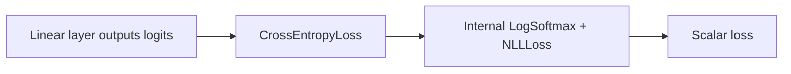
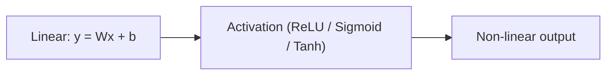

# PyTorch Neural Network Mini-Lecture

This folder is a step-by-step PyTorch walkthrough focused on how neural networks work in practice: tensors and gradients, loss functions, optimizers, data pipelines, and common model patterns.

## What you will learn
- How PyTorch autograd computes gradients (manual vs automatic).
- How to build and train linear, logistic, and feedforward neural networks.
- How to use data loaders, activation functions, and softmax/cross-entropy.
- How to save, load, and transfer learned models.

## File guide with usage notes (in learning order)
1. `01_intro.py` - Tensor basics and simple operations.
   Use this to learn how data is represented. Most PyTorch APIs expect `torch.Tensor`, so understand shapes, dtype, and device early.
2. `02_gradient.py` - Gradient concepts and how autograd tracks ops.
   Use `requires_grad=True` when you want gradients. Avoid tracking in evaluation by using `torch.no_grad()`.
3. `03_gradient_eg.py` - Gradient examples and sanity checks.
   Use small examples to verify your math before building bigger models.
4. `04_backporpogation.py` - Manual backprop on a tiny example.
   Learn what the backward pass is doing so debugging later is easier.
5. `05_gradient_manual.py` - Manual gradient computation step-by-step.
   Use this to understand chain rule and why gradients accumulate.
6. `05_gradient_auto.py` - Automatic gradient computation with autograd.
   Use autograd to avoid hand-deriving gradients; remember to zero gradients each step.
7. `06_loss_and_optimizer.py` - Loss functions and optimizers basics.
   Use `nn.MSELoss`, `nn.CrossEntropyLoss`, `optim.SGD`, `optim.Adam` depending on task. Choose loss that matches your output.
8. `06_model_loss_and_optimizer.py` - Model + loss + optimizer end-to-end.
   Shows the standard training loop pattern and how to connect model, loss, and optimizer.
9. `07_linear_regression.py` - Linear regression as a 1-layer model.
   Use it to learn the simplest supervised training loop and interpret weights.
10. `08_logistic_regression.py` - Binary classification with sigmoid.
   Use `sigmoid` for probability in binary tasks; handle class imbalance with weighting if needed.
11. `09_dataloader.py` - Mini-batching and DataLoader usage.
   Use `Dataset` and `DataLoader` to handle large datasets, shuffling, and batching safely.
12. `10_transformers.py` - Intro transformer building blocks.
   This file demonstrates **data transforms** (not Transformers). Use it to learn how to preprocess samples before training.
13. `11_softmax_and_crossentropy.py` - Multi-class output + loss.
   Use raw logits with `CrossEntropyLoss` (it applies softmax internally). Do not add a final softmax during training.
14. `12_activation_functions.py` - ReLU, sigmoid, tanh and their roles.
   Use ReLU for deep nets, tanh for bounded outputs, sigmoid for binary probabilities.
15. `12_plot_activation.py` - Plot activations for intuition.
   Use visualization to understand saturation and gradient flow.
16. `13_feedforward.py` - Multi-layer feedforward network.
   Use `nn.Sequential` or custom `nn.Module` to build stacked layers and train end-to-end.
17. `14_transfer_learning.py` - Using a pretrained model.
   Use pretrained backbones to save training time. Freeze layers you do not want to update.
18. `15_save_load.py` - Save/load model weights.
   Use `state_dict()` for portability and reproducibility. Always save the model architecture separately.
19. `test.py` - Quick checks or scratch experiments.
   Use it to validate small changes before editing the main scripts.

## Mermaid flowcharts (clear usage explanation)

**09_dataloader.py (Dataset -> DataLoader -> Training Loop)**  
Why: You cannot load huge datasets at once. `Dataset` defines how to read a single sample. `DataLoader` batches and shuffles for efficient training.


**10_transformers.py (Transforms Pipeline)**  
Why: Transforms clean and standardize data so the model sees consistent input. `Compose` chains multiple steps.


**11_softmax_and_crossentropy.py (Logits -> Probabilities -> Loss)**  
Why: For multi-class classification, use raw logits and `CrossEntropyLoss`. It applies softmax internally, so no extra softmax in the model.


**12_activation_functions.py (Activation Choices)**  
Why: Activations add non-linearity so networks can learn complex patterns. Different activations change gradient flow and output range.


Artifacts and data:
- `data/` - datasets used by the examples.
- `model.pth`, `checkpoint.pth` - saved model weights/checkpoints.

## Neural network concepts in PyTorch (quick overview)
- **Tensors** are the core data structure. All models operate on tensors.
- **Parameters** (weights and biases) are tensors with `requires_grad=True`.
- **Forward pass** computes predictions from inputs through layers.
- **Loss function** compares predictions with targets.
- **Backward pass** computes gradients via autograd.
- **Optimizer** updates parameters using gradients.
- **Training loop** repeats forward, loss, backward, step.

A minimal training loop looks like:
```python
for x, y in dataloader:
    y_hat = model(x)
    loss = criterion(y_hat, y)
    optimizer.zero_grad()
    loss.backward()
    optimizer.step()
```

## Practice questions (PyTorch neural networks)
1. What changes if you forget `optimizer.zero_grad()` in a training loop?
2. Implement a 2-layer MLP for classification. How does accuracy change if you swap ReLU for tanh?
3. Why do we use `CrossEntropyLoss` without a final softmax layer in PyTorch?
4. Create a custom `Dataset` and load it with `DataLoader`. What happens when you change `batch_size`?
5. Compare training with SGD vs Adam on the same model and dataset.
6. Implement dropout in a feedforward network and compare train vs test accuracy.
7. Save a trained model and reload it. Verify that outputs match before and after saving.
8. Freeze all but the last layer of a pretrained model. What effect does it have on training time and accuracy?
9. Plot gradients over time for a deep network. Do you observe vanishing or exploding gradients?
10. Build a simple transformer block and overfit it on a tiny dataset. What parts are hardest to stabilize?

## Suggested next steps
- Start with `01_intro.py` and progress in order.
- After each script, answer one practice question and try to implement it in code.
