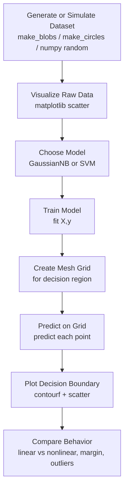
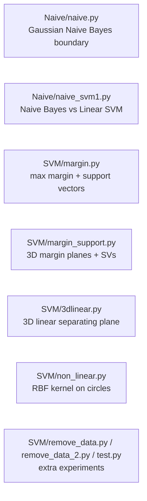
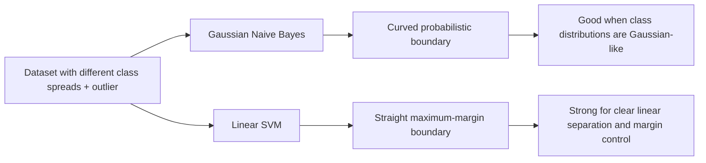

# Lecture: SVM and Naive Bayes Visual Learning

This project demonstrates core machine learning classification ideas using small Python scripts and visualizations.

## Project Workflow



### Script Map



## Setup and Run

1. Install dependencies:

```bash
pip install numpy matplotlib scikit-learn
```

2. Run any script:

```bash
python Naive/naive.py
python Naive/naive_svm1.py
python SVM/margin.py
python SVM/non_linear.py
```

## SVM Theory (Support Vector Machine)

SVM is a discriminative classifier that finds a decision boundary with the **maximum margin** between classes.

- Decision boundary (linear):
  - `w^T x + b = 0`
- Margin boundaries:
  - `w^T x + b = +1` and `w^T x + b = -1`
- Margin width:
  - `2 / ||w||`
- Support vectors are the nearest points to the boundary and define the final model.

### Why it works

Maximizing margin improves generalization: a wider separation is usually less sensitive to noise.

### Kernels

When data is not linearly separable:

- Linear kernel: straight boundary
- RBF kernel: curved/nonlinear boundary

Your `SVM/non_linear.py` shows this with circle-shaped data where linear SVM fails and RBF SVM succeeds.

### Simple Example

- Suppose class A and class B are separable by a line.
- SVM picks not just any separating line, but the one with the largest gap from both classes.
- In your `SVM/margin.py`, this is visualized with one center line and two dashed margin lines.

## Naive Bayes Theory

Naive Bayes is a probabilistic classifier based on Bayes' theorem with a conditional independence assumption.

- Bayes rule:
  - `P(C|x) = P(x|C)P(C) / P(x)`
- Naive assumption:
  - Features are conditionally independent given class `C`.

In Gaussian Naive Bayes (used in your code), each feature is modeled as a Gaussian distribution per class.

### Why it works

Even though the independence assumption is often not exactly true, Naive Bayes works well in many practical tasks and is very fast.

### Simple Example

For two features (`x1`, `x2`) and two classes (`0`, `1`):

1. Estimate class priors `P(C=0)`, `P(C=1)`.
2. Estimate Gaussian parameters for each feature per class.
3. Compute score for each class:
   - `P(C) * P(x1|C) * P(x2|C)`
4. Choose the class with larger posterior score.

In your `Naive/naive.py`, this produces a smooth curved boundary that adapts to class distribution shape.

## Naive Bayes vs SVM (in this project)



`Naive/naive_svm1.py` is the direct comparison script.

## Key Learning Outcomes

- Understand maximum margin and support vectors in SVM.
- See why kernels are needed for nonlinear patterns.
- Understand Naive Bayes as a probability-based classifier.
- Compare geometric (SVM) vs probabilistic (Naive Bayes) decision behavior.
